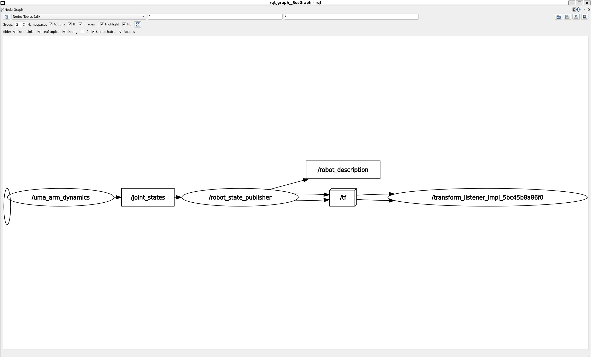
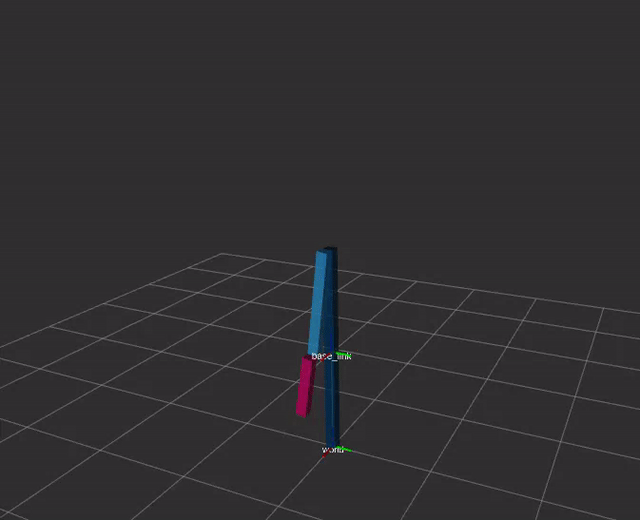

# uma_arm_control
This is the UMA arm control repo

## Launch the Dynamic model
ros2 launch uma_arm_control uma_arm_dynamics_launch.py

## Implementación del modelo dinámico

### Calcular la aceleración

La dinámica de un manipulador robótico de cadena cinemática abierta está dada por:

$$ \mathbf{M}(\mathbf{q})\ddot{\mathbf{q}} + \mathbf{C}(\mathbf{q}, \dot{\mathbf{q}})\dot{\mathbf{q}} + \mathbf{F}_b\dot{\mathbf{q}} + \mathbf{g}(\mathbf{q}) = \boldsymbol{\tau} + \boldsymbol{\tau}_{ext} $$

donde:

* $\mathbf{P} \in \mathbb{R}^{n \times 1}$ es el vector de las posiciones articulares (). `joint_positions_`
* $\dot{\mathbf{q}} \in \mathbb{R}^{n \times 1}$ es el vector de velocidades conjuntas (). `joint_velocities_`
* $\ddot{\mathbf{q}} \in \mathbb{R}^{n \times 1}$ es el vector de aceleraciones de la articulación (). `joint_accelerations_`
* $\mathbf{M}(\mathbf{q}) \in \mathbb{R}^{n \times n}$ es la matriz de inercia.
* $\mathbf{C}(\mathbf{q}, \dot{\mathbf{q}}) \in \mathbb{R}^{n \times n}$ es la matriz de Coriolis y fuerzas centrífugas.
* $\mathbf{F}_b \in \mathbb{R}^{n \times n}$ es la matriz de fricción viscosa.
* $\mathbf{g} \in \mathbb{R}^{n \times 1}$ es el vector de gravedad.
* $\boldsymbol{\tau} \in \mathbb{R}^{n \times 1}$ es el vector de los torques articulares comandados (). `joint_torques_`
* $\boldsymbol{\tau}_{ext} \in \mathbb{R}^{n \times 1}$ es el vector de los torques de la articulación debidos a fuerzas externas.

En nuestro caso, la aceleración debida a los torques aplicados está dada por:

$$ \ddot{\mathbf{q}} = \mathbf{M}^{-1}(\mathbf{q})[ \boldsymbol{\tau} + \boldsymbol{\tau}_{ext} - \mathbf{C}(\mathbf{q}, \dot{\mathbf{q}})\dot{\mathbf{q}} - \mathbf{F}_b\dot{\mathbf{q}} - \mathbf{g}(\mathbf{q}) ] $$

Para calcular las aceleraciones de las articulaciones, primero necesitamos calcular las matrices. Pueden calcularse aplicando las formulaciones de Lagrange o Newton-Euler. En nuestro caso, las matrices se definen por:

$$ 
\mathbf{M}(\mathbf{q}) = 
\begin{bmatrix} 
m_1 \cdot l_1^2 + m_2 \cdot (l_1^2 + 2 \cdot l_1 \cdot l_2 \cdot \cos(q_2) + l_2^2) & m_2 \cdot (l_1 \cdot l_2 \cdot \cos(q_2) + l_2^2) \\ 
m_2 \cdot (l_1 \cdot l_2 \cdot \cos(q_2) + l_2^2) & m_2 \cdot l_2^2 
\end{bmatrix} 
$$

$$ 
\mathbf{C}(\mathbf{q}, \dot{\mathbf{q}})\dot{\mathbf{q}} = 
\begin{bmatrix} 
-m_2 \cdot l_1 \cdot l_2 \cdot \sin(q_2) \cdot (2 \cdot \dot{q}_1 \cdot \dot{q}_2 + \dot{q}_2^2) \\ 
m_2 \cdot l_1 \cdot l_2 \cdot \dot{q}_1^2 \cdot \sin(q_2) 
\end{bmatrix} 
$$

$$ 
\mathbf{F}_b = 
\begin{bmatrix} 
b_1 & 0 \\ 
0 & b_2 
\end{bmatrix} 
$$

$$ 
\mathbf{g}(\mathbf{q}) = 
\begin{bmatrix} 
(m_1 + m_2) \cdot l_1 \cdot g \cdot \cos(q_1) + m_2 \cdot g \cdot l_2 \cdot \cos(q_1 + q_2) \\ 
m_2 \cdot g \cdot l_2 \cdot \cos(q_1 + q_2) 
\end{bmatrix} 
$$

También necesitaremos calcular el jacobiano para incluir las llaves externas aplicadas en el EE en nuestro modelo:

$$ 
\mathbf{J}(\mathbf{q}) = 
\begin{bmatrix} 
-l_1 \cdot \sin(q_1) - l_2 \cdot \sin(q_1 + q_2) & -l_2 \cdot \sin(q_1 + q_2) \\ 
l_1 \cdot \cos(q_1) + l_2 \cdot \cos(q_1 + q_2) & l_2 \cdot \cos(q_1 + q_2) 
\end{bmatrix} 
$$

Entonces, podemos calcular τ_ext como:

$$ \boldsymbol{\tau}_{ext} = \mathbf{J}(\mathbf{q})^T \cdot \mathbf{F}_{ext} $$

### Integrar posición y velocidad

Como estamos implementando un sistema discreto:

$$ \ddot{\mathbf{q}}_{k+1} = \mathbf{M}^{-1}(\mathbf{q}_k)[ \boldsymbol{\tau}_k + \boldsymbol{\tau}_{ext_k} - \mathbf{C}(\mathbf{q}_k, \dot{\mathbf{q}}_k)\dot{\mathbf{q}}_k - \mathbf{F}_b\dot{\mathbf{q}}_k - \mathbf{g}(\mathbf{q}_k) ] $$

podemos obtener las velocidades y posición conjuntas mediante integración discreta a lo largo del tiempo como:

$$\dot{\mathbf{q}} = \int \ddot{\mathbf{q}} \, dt \implies \dot{\mathbf{q}}_{k+1} = \dot{\mathbf{q}}_k + \ddot{\mathbf{q}}_{k+1} \cdot \Delta t$$

$$ \mathbf{q} = \int \dot{\mathbf{q}} Dt \implies \mathbf{q}_{k+1} = \mathbf{q}_k + \dot{\mathbf{q}}_{k+1} \cdot \Delta t $$

## Lanzar el nodo del simulador dinámico

Esquema como esta en el enunciado:

## Representación gráfica

### Experimento 1

uma_arm_dynamics:
  ros__parameters:
    frequency: 1000.0
    m1: 3.0
    m2: 2.0
    l1: 1.0
    l2: 0.6
    b1: 5.0
    b2: 5.0
    g: 9.81
    q0: [0.785398, -0.785398]

Posición 1:

Posición 2:

Posición 2 vs Velocidad 2:

Velocidades:

Aceleraciones:

### Experimento 2

uma_arm_dynamics:
  ros__parameters:
    frequency: 1000.0
    m1: 1.5
    m2: 1.0
    l1: 1.0
    l2: 0.6
    b1: 2.5
    b2: 2.5
    g: 9.81
    q0: [0.785398, -0.785398]
Posición 1:

Posición 2:

Velocidades:

Aceleraciones:

### Experimento 3

uma_arm_dynamics:
  ros__parameters:
    frequency: 1000.0
    m1: 1.0
    m2: 8.0
    l1: 1.0
    l2: 0.6
    b1: 4.0
    b2: 1.0
    g: 9.81
    q0: [0.785398, -0.785398]

Posiciones:

Velocidades

Aceleraciones:

### Experimento 4

uma_arm_dynamics:
  ros__parameters:
    frequency: 1000.0
    m1: 7.0
    m2: 1.0
    l1: 1.0
    l2: 0.6
    b1: 4.0
    b2: 2.0
    g: 9.81
    q0: [0.785398, -0.785398]

Posiciones:

Velocidades

Aceleraciones:

